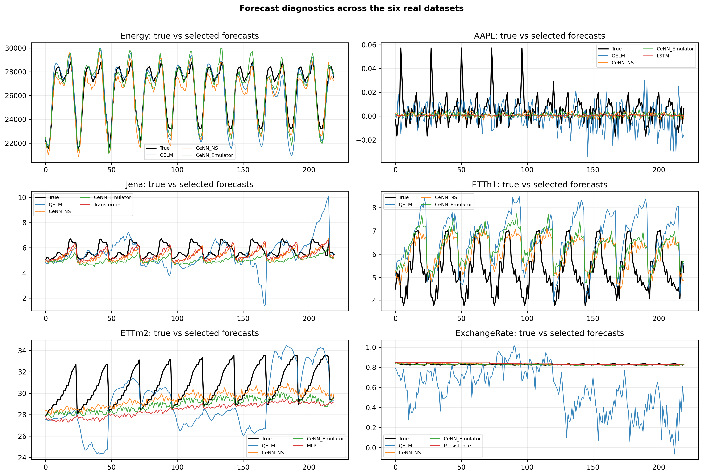

# Systematic Review of Quantum Machine Learning Techniques for Time-Series Forecasting

This repository contains the reproducibility package for the revised manuscript:

**Quantum-Inspired Time Series Forecasting: A Systematic Review and Neuro-Symbolic Emulation Framework**.

The repository is organized for reviewer inspection and controlled replication of the proof-of-concept benchmark. It is **not** a production software release and does **not** claim quantum advantage, quantum-state simulation, or industrial deployment readiness.

## Repository status

- Public repository target: `https://github.com/gedeonnkishi/Systematic-Review-of-Quantum-Machine-Learning-Techniques-for-Time-Series-Forecasting`
- Benchmark mode represented here: `full`
- Input window: `48`
- Forecasting horizon: `24`
- Split ratios: `[0.7, 0.15, 0.15]`
- Primary metric: `MASE`
- Synthetic data: `True`
- Output CSV files included: `309`
- Prediction CSV files included: `300`
- Figures included: `22` PNG and `22` PDF files under `outputs/full_run/`

## What is included

```text
.
├── README.md
├── REVIEWER_CHECKLIST.md
├── LICENSE
├── CITATION.cff
├── requirements.txt
├── environment.yml
├── configs/
│   └── benchmark_config.yaml
├── data/
│   └── README.md
├── docs/
│   ├── github_upload_instructions.md
│   ├── repository_inventory.md
│   ├── reproducibility_protocol.md
│   ├── limitations_and_scope.md
│   └── reviewer_response_repository_text.md
├── notebooks/
│   ├── neurosymbolic-cenn-qml-tsf-benchmark.ipynb
│   ├── reproduce_results_from_outputs.ipynb
├── outputs/
│   └── full_run/
│       ├── benchmark_full.csv
│       ├── summary_full.csv
│       ├── rankings_mase_full.csv
│       ├── statistical_comparison_full.csv
│       ├── emulation_fidelity_full.csv
│       ├── emulation_summary_full.csv
│       ├── dataset_manifest.csv
│       ├── article_figure_manifest.csv
│       ├── metadata_full.json
│       ├── figures/
│       └── predictions/
├── figures/
│   ├── core_article/
│   ├── supplementary_diagnostics/
│   └── notebook_output_cells/
└── src/
```

## Main files for reviewers

| File | Purpose |
|---|---|
| `outputs/full_run/benchmark_full.csv` | Run-level benchmark results for all datasets, models and seeds. |
| `outputs/full_run/summary_full.csv` | Aggregated metric summaries. |
| `outputs/full_run/rankings_mase_full.csv` | MASE ranking by dataset and model. |
| `outputs/full_run/statistical_comparison_full.csv` | Paired comparisons and effect-size indicators. |
| `outputs/full_run/emulation_fidelity_full.csv` | Run-level CeNN--QELM functional-emulation metrics. |
| `outputs/full_run/emulation_summary_full.csv` | Aggregated emulation-fidelity metrics. |
| `outputs/full_run/dataset_manifest.csv` | Dataset provenance, length, target and transformation. |
| `outputs/full_run/metadata_full.json` | Configuration and environment metadata. |
| `outputs/full_run/figures/core_article/` | Main article figures in PNG and PDF. |
| `outputs/full_run/figures/supplementary_diagnostics/` | Supplementary diagnostic figures. |
| `outputs/full_run/predictions/` | Prediction files for dataset/model/seed combinations. |

## Quick start

```bash
python -m venv .venv
source .venv/bin/activate  # Windows: .venv\Scripts\activate
pip install -r requirements.txt
jupyter lab
```

Open:

```text
notebooks/reproduce_results_from_outputs.ipynb
```

This notebook loads the exported CSV files and displays the key results and figures. The main benchmark notebook file is kept at:

```text
notebooks/neurosymbolic-cenn-qml-tsf-benchmark.ipynb
```

## Important note about notebooks

The uploaded `results.zip` contained exported results, figures, and CSV outputs, but no original `.ipynb` notebook file. Therefore, this package includes:

1. the structured benchmark notebook scaffold; and
2. a result-inspection notebook that verifies and displays the exported outputs.

Before final GitHub publication, replace `notebooks/neurosymbolic-cenn-qml-tsf-benchmark.ipynb` with the exact Kaggle/Colab notebook used to generate the results, if available.


## Core Evaluation Diagnostics

This panoramic figure presents the prediction diagnostics across the six real-world datasets covered in this study (Energy, AAPL, Jena, ETTh1, ETTm2, ExchangeRate). It overlays our framework's predictions (CeNN_Emulator, CeNN_NS) with the ground truth (True) and key benchmark models (LSTM, Transformer, QELM), demonstrating the functional emulation fidelity.

<p align="center">
  
</p>

---

## Quick Result Snapshot

### Dataset Manifest

| name | used_length | target_col | transform |
|:---|---:|:---|:---|
| Energy | 20000 | PJME_MW | identity |
| AAPL | 2517 | Close/Last | log_return |
| Jena | 20000 | T (degC) | identity |
| ETTh1 | 17420 | OT | identity |
| ETTm2 | 20000 | OT | identity |
| ExchangeRate | 7588 | OT | identity |

### Average MASE Rank by Model

| model | rank_MASE |
|:---|---:|
| MLP | 3 |
| N-HiTS | 3.5 |
| LSTM | 4.33333 |
| N-BEATS | 4.5 |
| Transformer | 5.16667 |
| CeNN_Emulator | 5.66667 |
| CeNN_NS | 5.66667 |
| Persistence | 7 |
| QELM | 7.83333 |
| MovingAverage | 8.33333 |

### Functional Emulation Summary

| dataset | model | emul_Pearson_r_mean | observable_Pearson_r_mean |
|:---|:---|---:|---:|
| AAPL | CeNN_Emulator | 0.0685806 | 0.687264 |
| AAPL | CeNN_NS | 0.0675527 | 0.680065 |
| ETTh1 | CeNN_Emulator | 0.975064 | 0.994723 |
| ETTh1 | CeNN_NS | 0.972277 | 0.992033 |
| ETTm2 | CeNN_Emulator | 0.164087 | 0.908964 |
| ETTm2 | CeNN_NS | 0.113736 | 0.928238 |
| Energy | CeNN_Emulator | 0.978437 | 0.988634 |
| Energy | CeNN_NS | 0.975564 | 0.985983 |
| ExchangeRate | CeNN_Emulator | 0.175783 | 0.905146 |
| ExchangeRate | CeNN_NS | 0.168842 | 0.891726 |
| Jena | CeNN_Emulator | 0.498423 | 0.994812 |
| Jena | CeNN_NS | 0.495092 | 0.995411 |

---

## Scope Limitation

The package supports inspection and controlled replication of the reported proof-of-concept benchmark. It does not establish quantum computational advantage, physical quantum equivalence, universal forecasting superiority, or deployment readiness.
